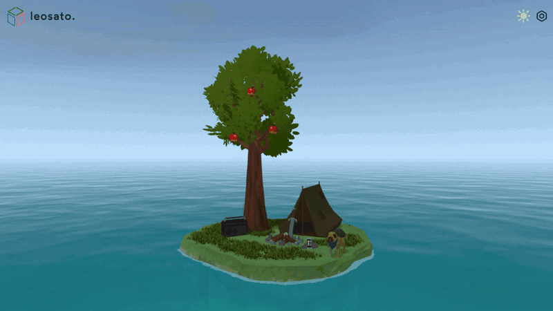

<div align="center">

# leosato.

**Interactive 3D portfolio — a floating island built with Three.js, TypeScript & Vite**



[](https://www.typescriptlang.org/)
[](https://threejs.org/)
[](https://vitejs.dev/)
[](./LICENSE)

</div>

---

## Overview

A fully interactive 3D scene rendered in the browser — no frameworks, no UI libraries. A hand-crafted floating island with physics-based apples, procedural grass, an underwater environment, a music player, and interactive objects like a pug, a chest, a phone, and a campfire.

Everything runs in a single WebGL canvas with custom GLSL shaders injected via `onBeforeCompile`, a lightweight physics world (cannon-es), and a one-draw-call procedural grass system.

---

## Features

- **Procedural grass** — 200+ blades in a single draw call, wind-animated via Perlin noise vertex shader
- **Custom ocean shader** — volumetric water, foam mask, ripple system, underwater distortion
- **Physics-based apples** — click to shake the tree; apples fall with cannon-es rigid body simulation
- **Procedural skybox** — day/night cycle with a sun, stars, and atmospheric scattering
- **Underwater mode** — full visibility swap, fog, fish, coral, bubbles, kelp
- **Interactive objects** — pug with animation clips, radio with audio visualizer, phone screen overlay, chest with collectibles
- **Post-processing** — custom fullscreen shader pass (underwater distortion, pixelation, color filters)
- **Responsive** — adaptive quality for mobile (shadows off, DPR capped, touch support)
- **PWA** — installable, offline-capable via service worker

---

## Tech stack

| Layer | Technology |
|---|---|
| Renderer | [Three.js r183](https://threejs.org/) |
| Language | TypeScript 5.2 |
| Build | Vite 5 + vite-plugin-glsl |
| Physics | [cannon-es](https://github.com/pmndrs/cannon-es) |
| Audio | Web Audio API + [WaveSurfer.js](https://wavesurfer.js.org/) |
| Debug GUI | [lil-gui](https://lil-gui.georgealways.com/) |
| Animations | [Bezier Easing](https://github.com/gre/bezier-easing) |
| Testing / Capture | Playwright + Puppeteer |
| Asset pipeline | sharp, @gltf-transform |

---

## Prerequisites

- **Node.js** ≥ 18
- **npm** ≥ 9
- A browser with **WebGL 2** support (Chrome, Firefox, Edge, Safari 15+)

---

## Getting started

```bash
# 1. Clone the repository
git clone https://github.com/leonardogsato/portfolio.git
cd portfolio

# 2. Install dependencies
npm install

# 3. Start the development server
npm run dev
# → http://localhost:3000
```

---

## Browser support

| Browser | Status |
|---|---|
| Chrome / Edge 90+ | ✅ Full |
| Firefox 90+ | ✅ Full |
| Safari 15+ | ✅ Full |
| Mobile Chrome / Safari | ✅ Reduced quality mode |

WebGL 2 is required.

---

## License

MIT © [Leonardo Sato](https://github.com/leonardogsato)
